# Mosofin

**See how your business actually runs.** Mosofin is an agent skill that turns a short interview about your business — the software you use and how work and money move between it — into a validated, self-contained interactive HTML diagram. Map the whole operating stack (supply chain, CRM, commerce, inventory, fulfilment, payments, spend, payroll, bank, books, data) and see which system owns each part, where work changes hands, and how an order becomes revenue. The finance recipes go deeper where numbers must tie out: money maps, revenue walks, close runbooks, payout reconciliations, A/R and cash-runway views.


Current development version: `v1.0.0-dev.0` (see [ROADMAP.md](ROADMAP.md) and [CHANGELOG.md](CHANGELOG.md)).

Every figure, system, and arrow in a Mosofin diagram traces to the brief or to something the user stated. The renderer never calls QuickBooks, Stripe, Shopify, an ERP, or a bank; it never invents amounts, volumes, or headcounts; and it never marks a reconciliation green unless the user supplied a zero difference.

## Sample use case

**Northline Coffee Group — how the business runs.** A DTC + wholesale coffee roaster across three legal
entities, running HubSpot → Shopify → NetSuite/3PL → Stripe → Ramp/Gusto → Chase → three QuickBooks
companies. The skill was given the business brief in [`mosofin/examples/business-brief.md`](mosofin/examples/business-brief.md)
and asked *"map how our business runs"*; it routed to the `business-operating-map` recipe, grouped a
ten-system stack into 12 domain nodes, validated under `showcase`, and delivered the artifact.

- Rendered diagram: [docs/samples/business-operating-map.html](docs/samples/business-operating-map.html)
- Source spec: [mosofin/examples/business-operating-map.architecture.json](mosofin/examples/business-operating-map.architecture.json)

[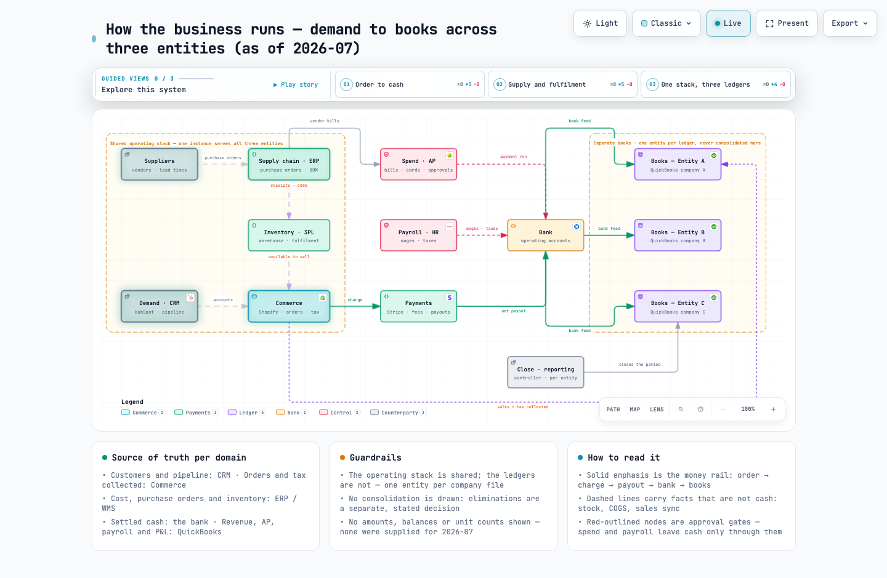](docs/samples/business-operating-map.html)

For the finance-first walkthrough — the exact prompt, command trail and receipt — see
[docs/USE-CASE.md](docs/USE-CASE.md) and its [money map](docs/samples/northline-money-map.html)
([spec](mosofin/examples/northline-money-map.architecture.json)).

## See it

Every image below is a real delivered artifact — no mockups. Each one validated at **9/9 checks,
0 errors, 0 warnings** under the `showcase` profile and carries no invented amounts.

### The whole business on one page

*How money and work move across a three-entity group: demand → supply chain → inventory → commerce →
payments → bank → three separate ledgers. Every node names the system that owns it.*

[](docs/samples/business-operating-map.html)

### It plays its own story

Press **P** in any artifact and it walks the reader through the map hop by hop, dimming everything
off the path and naming the source of truth at each stop. Recorded straight from the delivered HTML:

**Money map — *DTC order to cash***

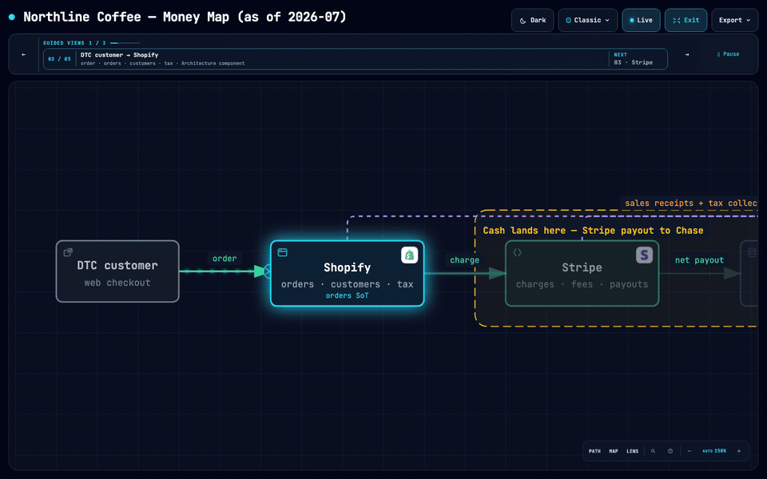

**Month-end close — *Pull the sources***

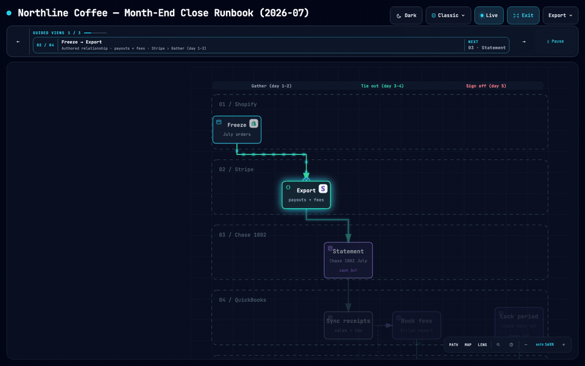

**Revenue walk — *Gross to net sales***

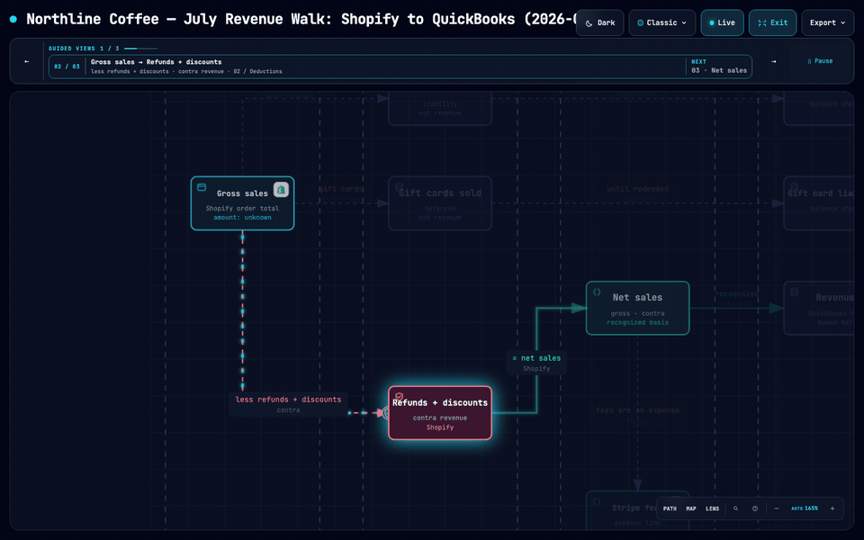

### Dark theme, same file

One artifact carries both themes; press **T** to flip.

[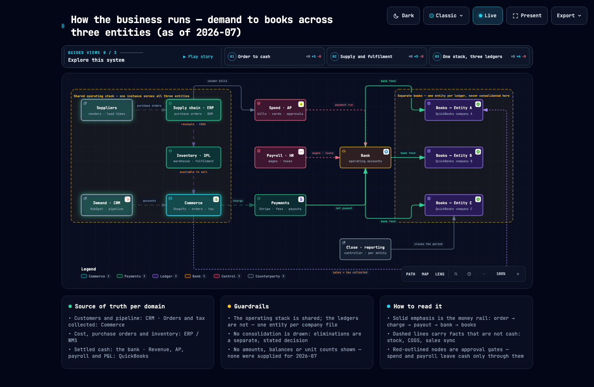](docs/samples/business-operating-map.html)

### Every recipe, rendered

The business operating map and all eight finance recipes, demonstrated on the same Northline group.
Click any screenshot for the full-size capture; dark-theme versions sit beside them in
[docs/samples/images/](docs/samples/images/).

| Recipe | Type | Screenshot | Open |
|---|---|---|---|
| `business-operating-map` | architecture | [](docs/samples/images/business-operating-map.light.png) | [HTML](docs/samples/business-operating-map.html) · [spec](mosofin/examples/business-operating-map.architecture.json) |
| `finance-money-map` | architecture | [](docs/samples/images/northline-money-map.light.png) | [HTML](docs/samples/northline-money-map.html) · [spec](mosofin/examples/northline-money-map.architecture.json) |
| `finance-order-path` | sequence | [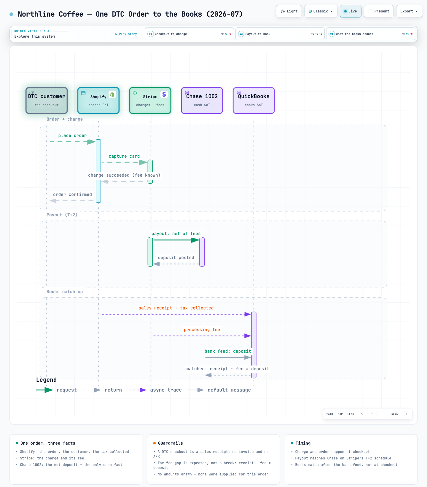](docs/samples/images/northline-order-path.light.png) | [HTML](docs/samples/northline-order-path.html) · [spec](mosofin/examples/northline-order-path.sequence.json) |
| `finance-revenue-walk` | dataflow | [](docs/samples/images/northline-revenue-walk.light.png) | [HTML](docs/samples/northline-revenue-walk.html) · [spec](mosofin/examples/northline-revenue-walk.dataflow.json) |
| `finance-close` | workflow | [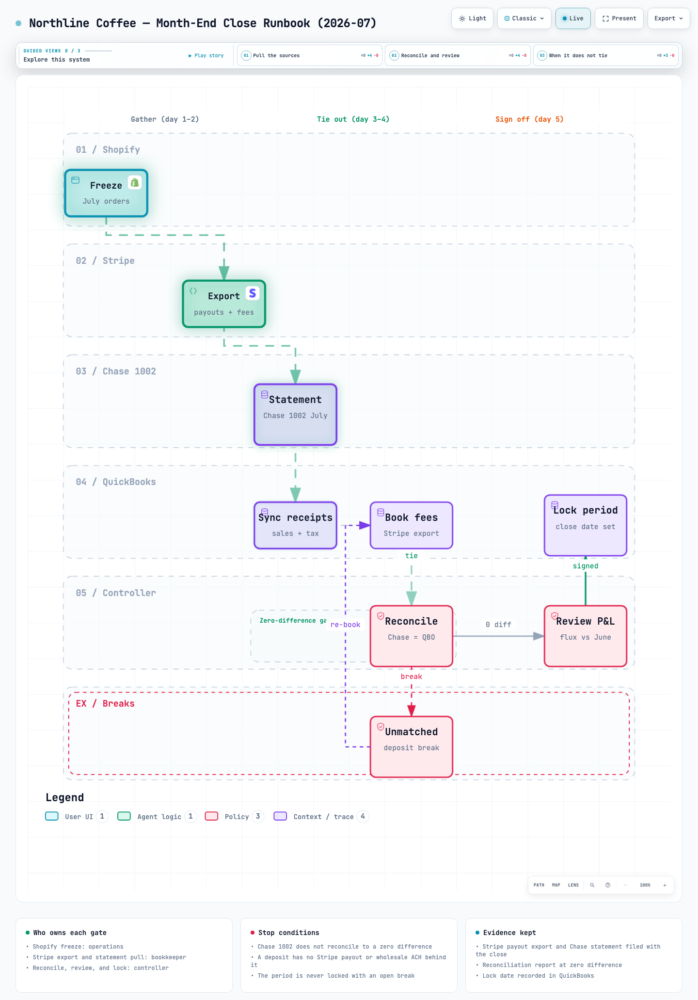](docs/samples/images/northline-close.light.png) | [HTML](docs/samples/northline-close.html) · [spec](mosofin/examples/northline-close.workflow.json) |
| `finance-dispute-lifecycle` | lifecycle | [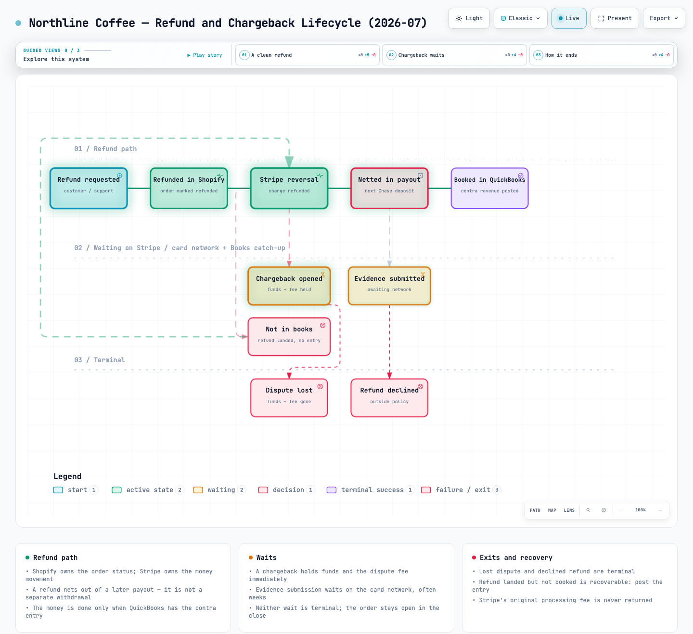](docs/samples/images/northline-dispute.light.png) | [HTML](docs/samples/northline-dispute.html) · [spec](mosofin/examples/northline-dispute.lifecycle.json) |
| `finance-payout-rec` | dataflow | [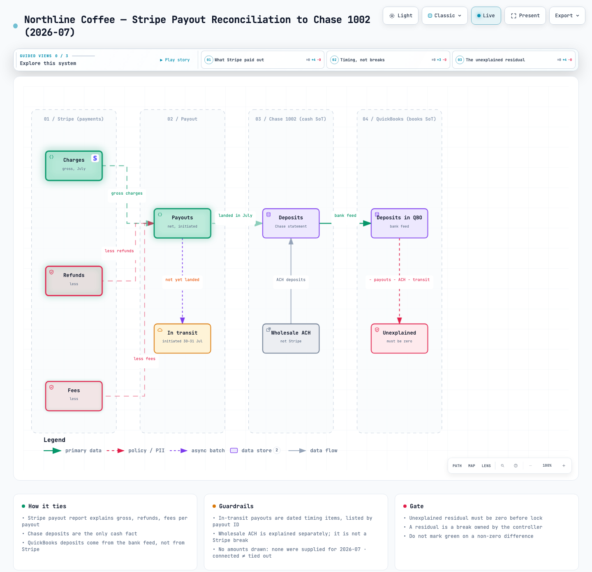](docs/samples/images/northline-payout-rec.light.png) | [HTML](docs/samples/northline-payout-rec.html) · [spec](mosofin/examples/northline-payout-rec.dataflow.json) |
| `finance-customer-ar` | architecture | [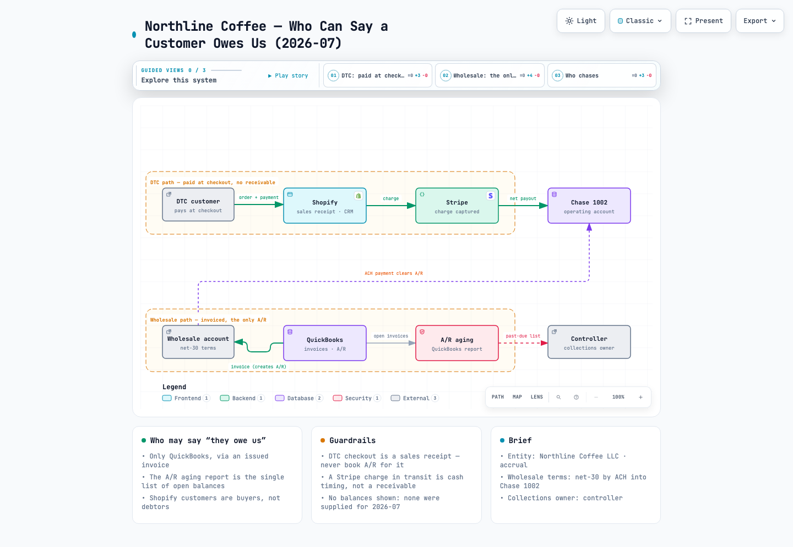](docs/samples/images/northline-customer-ar.light.png) | [HTML](docs/samples/northline-customer-ar.html) · [spec](mosofin/examples/northline-customer-ar.architecture.json) |
| `finance-cash-runway` | dataflow | [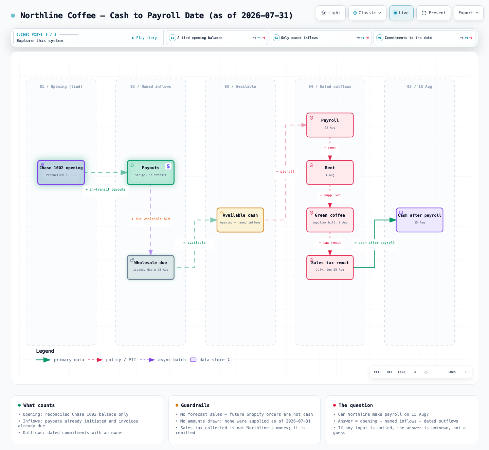](docs/samples/images/northline-cash-runway.light.png) | [HTML](docs/samples/northline-cash-runway.html) · [spec](mosofin/examples/northline-cash-runway.dataflow.json) |

Reproduce any of them from the skill directory:

```bash
cd mosofin
node bin/mosofin.mjs deliver dataflow examples/northline-revenue-walk.dataflow.json out.html --quality showcase --json
```

Or explore them live in the [proof gallery](https://diagram.mosofin.com/gallery.html).

## Quick start

### 1. Install

**Pick your agent, copy one line.** One checked Skill serves Cursor, Claude Code, Codex CLI, and OpenCode —
every command below installs the same thing from `MosoFin/mosofin-diagram`; `--global` puts it in your
home directory so every project can use it.

| Your agent | Command |
|---|---|
| **Claude Code** | `npx -y skills add MosoFin/mosofin-diagram --skill mosofin --agent claude-code --global --copy --yes` |
| **Cursor** | `npx -y skills add MosoFin/mosofin-diagram --skill mosofin --agent cursor --global --copy --yes` |
| **Codex CLI** | `npx -y skills add MosoFin/mosofin-diagram --skill mosofin --agent codex --global --copy --yes` |
| **OpenCode** | `npx -y skills add MosoFin/mosofin-diagram --skill mosofin --agent opencode --global --copy --yes` |
| **Not sure / let it ask** | `npx skills add MosoFin/mosofin-diagram -g` |

What the flags do — none of them are guesswork, and every command above is non-interactive:

| Flag | Effect | Change it when |
|---|---|---|
| `-y` | skips the `npx` download prompt | never — it only saves a keystroke |
| `--agent <name>` | installs to that agent's path without asking | you use a different agent |
| `--global` | installs once for every project | drop it to install into the current project only |
| `--copy` | copies the files instead of symlinking | drop it if you want the skill to track repo updates |
| `--yes` | accepts the install prompts | never — it is what makes the command non-interactive |

Two surfaces install by hand instead, because they are not agent-switcher targets:

- **Claude.ai** — upload [`mosofin.zip`](mosofin.zip) under Settings → Capabilities → Skills.
- **Raven** — a manual ZIP install: extract [`mosofin.zip`](mosofin.zip) into
  `~/.raven/workspace/skills`, which yields `~/.raven/workspace/skills/mosofin`.

Verify it landed:

```bash
node ~/.claude/skills/mosofin/bin/mosofin.mjs doctor   # adjust the path for your agent
```

### 1b. Update to the latest version

**Re-run the same install command.** `skills add` overwrites an existing install in place, so the
line you used above is also the update command — no uninstall step:

```bash
npx -y skills add MosoFin/mosofin-diagram --skill mosofin --agent claude-code --global --copy --yes
```

Check which build you have installed — the generator line in the packaged viewer template carries
the exact version:

```bash
grep -o 'mosofin [0-9][^"]*' ~/.claude/skills/mosofin/assets/template.html | head -1
# -> mosofin 1.0.0-dev.0        (adjust the path for your agent)
```

| You installed with | To update |
|---|---|
| `--copy` (the commands above) | re-run the install command — a copy never updates itself |
| without `--copy` (symlinked to a clone) | `git pull` in your clone; the skill follows immediately |
| `mosofin.zip` on Claude.ai | download [`mosofin.zip`](mosofin.zip) again and re-upload it under Settings → Capabilities → Skills |
| `mosofin.zip` on Raven | download it again and re-extract over `~/.raven/workspace/skills` |

[`mosofin.zip`](mosofin.zip) on the default branch is rebuilt automatically whenever anything inside
`mosofin/` changes (see [Releasing](#releasing)), so it always matches the current skill.

### 2. Describe the business, then ask one question

Mosofin opens with a short interview and stores it in the workspace. Which interview depends on the question: mapping how the business runs uses the domain catalog (CRM, commerce, supply chain, inventory, fulfilment, payments, spend, payroll, bank, books, data) and writes `BUSINESS-BRIEF.md`; a question whose numbers must tie out uses the finance interview (entity, accounting method, source of truth for orders / cash / books) and writes `FINANCE-BRIEF.md`. A finance brief already on file counts as a partial business brief. After that, ask in plain language:

```text
Use mosofin to map how our business runs — from HubSpot leads and NetSuite purchase
orders through Shopify, the 3PL, Stripe and Ramp into each entity's QuickBooks.
Show which system owns each part.
```

```text
Use mosofin to map where Northline Coffee's money flows — from Shopify checkout to the
QuickBooks P&L — and show which system is the source of truth at each hop.
```

```text
Use mosofin to walk July revenue from Shopify gross sales to the QuickBooks revenue line.
Show every deduction as its own step; do not invent amounts.
```

### 3. Refine in chat

Continue with focused requests such as `add the wholesale invoice path`, `show Chase 1002 as the cash boundary`, or `highlight the refund route`. Mosofin keeps the typed source available for targeted iteration.

## Scenarios

Run `node bin/mosofin.mjs guide "<your sentence>"` to route a plain-language question to a recipe. Business recipes are matched first, then finance; the generic engineering recipes remain available as a fallback.

**Business — how the whole thing runs**

| Recipe | Diagram type | Question it answers |
|---|---|---|
| `business-operating-map` | architecture | How does the whole business run, and which system owns each part of it? |
| `business-handoffs` | workflow | Which team or system owns each step, and where does work change hands? |
| `business-order-journey` | sequence | What happens to one order, in time, across every system it touches? |

Business recipes read `references/business-onboarding.md` and the workspace `BUSINESS-BRIEF.md`. They group by domain and name the real tool in each sublabel, so a thirty-app stack still fits the 12-node cap.

**Finance — where the numbers have to tie out**

| Recipe | Diagram type | Question it answers |
|---|---|---|
| `finance-money-map` | architecture | Where does money flow across our systems, and which one is the source of truth? |
| `finance-order-path` | sequence | What happens to one order from checkout to the ledger? |
| `finance-revenue-walk` | dataflow | Why doesn't Shopify revenue match QuickBooks? |
| `finance-close` | workflow | What are the steps and gates in our month-end close? |
| `finance-dispute-lifecycle` | lifecycle | What states does a refund or chargeback pass through? |
| `finance-payout-rec` | dataflow | Does the Stripe payout reconcile to the bank deposit? |
| `finance-customer-ar` | architecture | Who owes us money, through which channel, and who chases it? |
| `finance-cash-runway` | dataflow | Can we make payroll on a named date? |

Each recipe has a verified Northline artifact in [Sample diagrams](#sample-diagrams) and the [proof gallery](https://diagram.mosofin.com/gallery.html); the generic engineering recipes link to the proof of the same diagram type.

Finance recipe prompts begin by reading `references/finance-onboarding.md` and the workspace `FINANCE-BRIEF.md`. Both contracts carry the same guardrails: one system of record per fact, no invented amounts or volumes, `connected` is not a tie-out.

## Choose the right diagram

| Type | Use for |
|---|---|
| `architecture` | The whole operating stack, money maps, system-of-record boundaries, A/R ownership |
| `workflow` | Team handoffs, close checklists, approval gates, payment runs |
| `sequence` | One order, invoice, or payout traced hop by hop across systems |
| `dataflow` | Revenue walks, payout reconciliations, cash runway, data lineage |
| `lifecycle` | Refund, dispute, invoice, and subscription states |
| `ledger` | A GL journal replayed across an account map: money moving between accounts, tie-outs, unmapped rows |

The [logo catalogue](https://diagram.mosofin.com/logos.html) lists the financial marks the skill
ships. It is generated by `npm run build:logos` from the shipped catalogue. The page is the
finance catalogue — ledgers, processors, banks, payroll, storefronts and 3PLs (QuickBooks, Xero,
Sage, SAP, Stripe, Adyen, Square, Visa, Mastercard, Chase, Gusto, ADP, Shopify, FedEx, DHL).
Developer marks still render in logo mode but are not listed here.

Set `meta.node_style: "logo"` to draw each node as its software logo instead of a labelled box. Every
mark ships inside the skill: no network call, no account. A node whose software has no mark keeps its
semantic role glyph rather than borrowing someone else's logo, and readers can switch either way in
the viewer (**Box / Logo** in the toolbar) without re-rendering.

Mosofin also accepts pasted Mermaid `flowchart`, `sequenceDiagram`, and `stateDiagram` input and re-authors it as a checked diagram.

## How it works

1. **Brief** — the skill reads or creates `BUSINESS-BRIEF.md` for a question about how the business runs (`references/business-onboarding.md` defines the domain catalog and the intent → diagram-type table), or `FINANCE-BRIEF.md` when the numbers have to tie out (`references/finance-onboarding.md`).
2. **Author** — the agent writes a small typed JSON spec against one of five schemas in `mosofin/schemas/`.
3. **Validate** — `node bin/mosofin.mjs validate <type> <spec> --quality showcase --json` runs nine artifact checks; showcase acceptance means 0 errors and 0 warnings.
4. **Deliver** — `node bin/mosofin.mjs deliver <type> <spec> <out.html> --quality showcase --json` freezes the spec bytes, renders, and reports SHA-256 receipts.
5. **Review** — `node bin/mosofin.mjs visual-check <out.html> --json` measures desktop containment at four viewports and captures light/dark screenshots. The optional `preview` command (`node bin/mosofin.mjs preview <type> <spec> <out.html> --quality showcase`) supports an active desktop authoring loop and is never started by default.

For an active desktop authoring loop, the optional Last-Good Live Preview serves the last verified artifact on `127.0.0.1` and republishes on every valid save; stop it with `Ctrl-C`:

```bash
node bin/mosofin.mjs preview workflow candidate.json out.html --quality showcase --no-open
```

Automatic Port Spread is a bounded default renderer behavior: shared automatic endpoints spread deterministically so that no automatic route creates a sub-8px segment or sub-16px interior turn.

## Explore and share the output

Every artifact is one standalone HTML file with dark/light themes, pan/zoom, search, focus, relationship tracing, semantic views, and presentation mode. The Export menu offers PNG, JPEG, WebP, SVG, and WebM, plus an optional **Share Card** (1200×630). Two scoped variants name their boundary instead of pretending to be canonical: the **Route Share Card** (Export → Route Share Card: one exact authored path with the rest of the map retained as context) and the **Reach Share Card** (the active authored reachability closure from one node). All are download-only and carry a truthful scoped receipt.

## Installation options

| Surface | Install location or method | Capability |
|---|---|---|
| **Raven** | Manual ZIP into `~/.raven/workspace/skills` → `~/.raven/workspace/skills/mosofin` | Full renderer + validation workflow |
| **Claude Code** | `~/.claude/skills/` or `.claude/skills/` | Full renderer + validation workflow |
| **Codex CLI** | `~/.agents/skills/` or `.agents/skills/` | Full renderer + validation workflow |
| **opencode** | `~/.config/opencode/skills/`, `.opencode/skills/`, or `.agents/skills/` | Full renderer + validation workflow |
| **Claude.ai** | Upload `mosofin.zip` under Settings → Capabilities → Skills | Depends on Node.js access in the sandbox |

## Reference and scope

- [Skill](mosofin/SKILL.md) · [Business onboarding contract](mosofin/references/business-onboarding.md) · [Finance onboarding contract](mosofin/references/finance-onboarding.md) · [Schema reference](mosofin/schemas/README.md) · [Examples](mosofin/examples/) · [Agent cookbook](docs/authoring-cookbook.md)
- [Use case](docs/USE-CASE.md) · [Scenario guide](https://diagram.mosofin.com/guide.html) · [Proof gallery](https://diagram.mosofin.com/gallery.html)
- [Changelog](CHANGELOG.md) · [Roadmap](ROADMAP.md)
- [Design handoff](docs/design-handoff/00-START-HERE.md) — every inherited visual component (logos, sigils, legends, chrome, presets, tokens) with sources, captures and a proposed finance redesign; rebuilt by `npm run build:design-handoff`

Live accounting-system access, automatic Mermaid layout, hosted sharing, and WYSIWYG editing are intentionally outside scope. Mosofin draws what the brief and the user state; it does not pull or reconcile live ledger data.

## Releasing

`mosofin.zip` is the packaged skill. It is **generated, not hand-edited**, and its bytes are
canonical — CI byte-compares the committed file against a fresh build, so a stale zip fails the build.

**You normally do not build it.** Push a change under `mosofin/` and
[`.github/workflows/refresh-zip.yml`](.github/workflows/refresh-zip.yml) rebuilds the zip on Node 22
and commits it back to `main`, so the download always matches the skill. Run it by hand from the
Actions tab (*refresh zip → Run workflow*) whenever you want.

To build it locally — needed only if you are cutting a release or debugging packaging:

```bash
cd mosofin
npm run build:zip     # refuses to run on anything but Node 22, with instructions
```

The Node major is pinned because zip bytes depend on the Node/zlib toolchain; CI, the release
workflow, and this script all use Node 22 so the three agree exactly.

| Job | Where | What it does |
|---|---|---|
| `refresh zip` | on push to `main` touching `mosofin/` | rebuilds and commits `mosofin.zip` |
| `zip-freshness` | every CI run | fails if the committed zip is stale |
| `package-smoke` | every CI run, on Linux/macOS/Windows | unpacks the zip and exercises the skill |
| `release` | on a version tag | re-verifies the zip and attaches it to the GitHub Release |

## Origins and license

Mosofin is a finance-specialised fork of [Archify](https://github.com/tt-a1i/archify) by tt-a1i, itself based on Cocoon AI's architecture-diagram-generator. Both are MIT; see [LICENSE](LICENSE). Mosofin is released under the [MIT](LICENSE) license.

## Contributing

Issues, pull requests, and real-world business or finance diagrams are welcome. Start with the [contribution guide](CONTRIBUTING.md), use the reproducible bug form for failures, or submit a validated diagram through the [community showcase form](https://github.com/MosoFin/mosofin-diagram/issues/new?template=showcase.yml).
