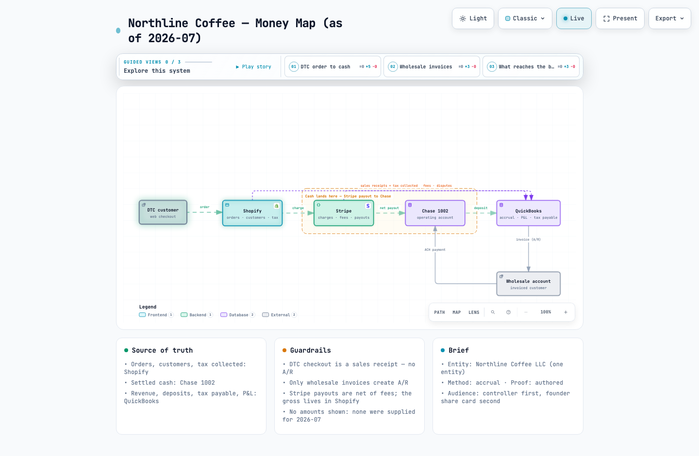
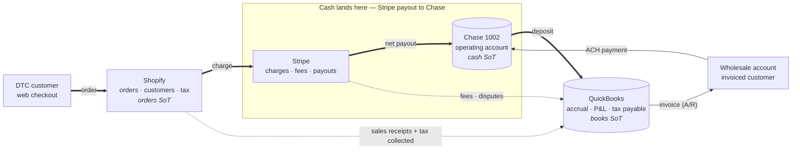
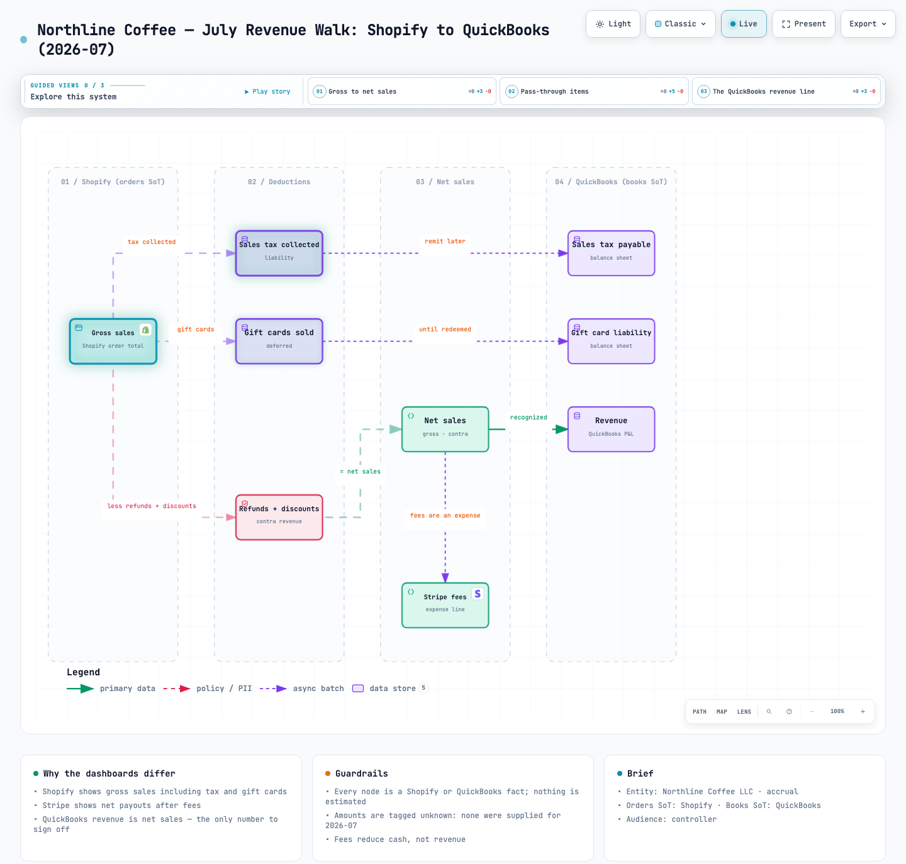
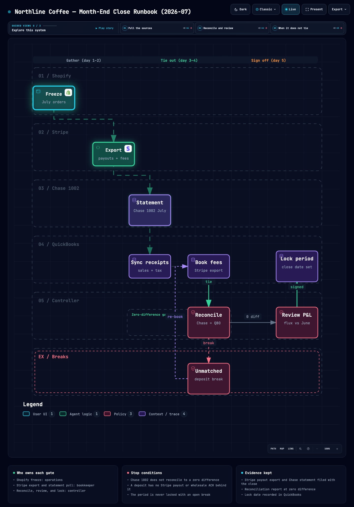

# Use case: Northline Coffee money map

This is the end-to-end sample shipped with Mosofin. It shows what happens when Claude Code is
given a finance brief and one plain-language question, and what the skill produces.

- **Rendered artifact:** [`docs/samples/northline-money-map.html`](samples/northline-money-map.html)
  (open locally — it is one self-contained HTML file; also published at
  <https://mosofin.github.io/mosofin-diagram/samples/northline-money-map.html>)
- **Source spec:** [`mosofin/examples/northline-money-map.architecture.json`](../mosofin/examples/northline-money-map.architecture.json)
- **Brief:** [`mosofin/examples/finance-brief.md`](../mosofin/examples/finance-brief.md)
- **Visual evidence:** `docs/samples/northline-money-map.visual-check.*` (four viewports, light + dark)
- **Screenshot:** [`docs/samples/images/northline-money-map.light.png`](samples/images/northline-money-map.light.png)



## 1. The brief

Northline Coffee LLC is a fictional DTC + wholesale roaster. Its `FINANCE-BRIEF.md` (the fixture
above) names one entity, accrual method, four systems, and three truth rules:

| System | Role | Source of truth for |
|---|---|---|
| Shopify | commerce + CRM | orders, customers, tax collected, gift cards |
| Stripe | payments | charges, fees, payouts, disputes |
| Chase 1002 | bank | settled operating cash |
| QuickBooks | books | revenue, deposits, tax payable, P&L |

Truth rules: orders originate in Shopify; cash lands in Chase via Stripe payout; revenue is
recognized in QuickBooks; DTC checkout is a sales receipt, so there is no A/R unless wholesale.

## 2. The prompt given to Claude Code

```text
Use the mosofin skill. The finance brief is in mosofin/examples/finance-brief.md.
Map where Northline Coffee's money flows — from Shopify checkout to the QuickBooks
P&L — and show which system is the source of truth at each hop. Period: 2026-07.
Audience: the controller. Do not invent any amounts.
```

## 3. What the skill did

1. **Onboarding (step 0).** Read `references/finance-onboarding.md`. The brief was complete
   (entity + systems + source of truth for orders, cash, books), so the full interview was
   skipped; period `2026-07` and the one-sentence question came from the prompt.
2. **Routing.** The sentence *"where does money flow / which system is source of truth"* maps to
   the first row of the intent table → `architecture` (recipe `finance-money-map`). Cross-check:

   ```bash
   node bin/mosofin.mjs guide "map where our money flows and which system is source of truth" --json
   # → recommendation.id = "finance-money-map", type = "architecture"
   ```

3. **Authoring.** Read `schemas/architecture.schema.json`, `schemas/common.schema.json`, and
   `examples/web-app.architecture.json` for field shape only. Wrote six primary nodes (well under
   the 12-node cap), one emphasised order-to-cash rail, two dashed book-sync edges, and the wholesale
   A/R loop. Built-in brand marks were used for Shopify and Stripe (`node bin/mosofin.mjs brands
   shopify --json`); QuickBooks has no built-in mark, so per the contract it carries none. Three
   guided views were added: *DTC order to cash*, *Wholesale invoices*, *What reaches the books*.
   No amounts appear anywhere because none were supplied — the Guardrails card says so explicitly.
4. **Validation loop.** Three rounds, each repairing only the diagnosed subject:

   | Round | Diagnostic | Repair |
   |---|---|---|
   | 1 | `composition/proper-crossing` — `fee-sync` (top corridor) crossed `ach` | moved the wholesale node below the rail; put both book-sync edges on the top corridor |
   | 2 | label `invoice (A/R)` overlapped the QuickBooks node | `labelDy: 48` (the validator's suggested fix) |
   | 3 | `visual-check` overflow: 937 px > 900 px at 1440×900 | compacted authored Y rhythm (rail 300→270, wholesale 500→450); no node, label, or panel was shrunk |

5. **Delivery.**

   ```bash
   node bin/mosofin.mjs validate architecture examples/northline-money-map.architecture.json --quality showcase --json
   node bin/mosofin.mjs deliver  architecture examples/northline-money-map.architecture.json ../docs/samples/northline-money-map.html --quality showcase --json
   MOSOFIN_CHROME="/Applications/Google Chrome.app/Contents/MacOS/Google Chrome" \
     node bin/mosofin.mjs visual-check ../docs/samples/northline-money-map.html --json
   ```

## 4. Receipt

```json
{
  "command": "deliver",
  "type": "architecture",
  "specification": { "sha256": "e170a603b504a71a8696167a60d3e5c432b98b7a46b86a657b4f467031a48cf0", "bytes": 5102 },
  "artifact":      { "sha256": "b59ac84337cd81edb39d18bab4b3f81da3c7d3e0d0d1e16f089ea155086fbf7c", "bytes": 708086 },
  "validation":    { "checksPassed": 9, "checkCount": 9, "compositionProfile": "showcase", "errors": 0, "warnings": 0 }
}
```

`visual-check`: containment **pass** at 1440×900, 1600×1000, 1920×1080, 2048×1320 (light and dark);
`visualReview` is reported as `pending` by the tool — the screenshots were then inspected by hand:
one legible rail, no label collisions, legend and navigation dock clear of the SVG.

## 5. The diagram (Mermaid fallback for GitHub)

The HTML artifact is the deliverable; this is a reduced sketch of the same authored facts so the
story is readable inline.



## 6. The other seven recipes on the same brief

The same brief, period, and guardrails were then put through every remaining finance recipe. Each
spec lives in `mosofin/examples/northline-*.json`, each artifact in `docs/samples/`, and each one
validated at 9/9 checks with 0 errors and 0 warnings under `showcase`. Full-page light and dark
screenshots are in [`docs/samples/images/`](samples/images/).

| Question asked | Recipe | Type | Artifact |
|---|---|---|---|
| What happens to one DTC order from checkout to the ledger? | `finance-order-path` | sequence | [northline-order-path.html](samples/northline-order-path.html) |
| Why doesn't Shopify revenue match QuickBooks for July? | `finance-revenue-walk` | dataflow | [northline-revenue-walk.html](samples/northline-revenue-walk.html) |
| What is month-end, in order, and who owns each gate? | `finance-close` | workflow | [northline-close.html](samples/northline-close.html) |
| If Shopify refunded it, is the money actually done? | `finance-dispute-lifecycle` | lifecycle | [northline-dispute.html](samples/northline-dispute.html) |
| Does the Stripe payout reconcile to the Chase deposit? | `finance-payout-rec` | dataflow | [northline-payout-rec.html](samples/northline-payout-rec.html) |
| Who is allowed to say a customer owes us? | `finance-customer-ar` | architecture | [northline-customer-ar.html](samples/northline-customer-ar.html) |
| Can we make payroll on 15 August? | `finance-cash-runway` | dataflow | [northline-cash-runway.html](samples/northline-cash-runway.html) |





Two honest notes on the evidence: the money map is the only artifact whose `visual-check`
containment passes at 1440×900 in the full-width reading layout — the other seven (like the
engineering examples that shipped before them) are taller than one 1440×900 screen in that layout
and report `containment: fail` there while fitting in Present mode; their `*.visual-check.json`
receipts are kept beside the HTML. And the money map now carries `animation: trace` like its
siblings, which is why its receipt above differs from the first delivery.

## 7. Reproduce it

```bash
cd mosofin
node bin/mosofin.mjs deliver architecture examples/northline-money-map.architecture.json /tmp/northline.html --quality showcase --json
```

The artifact SHA-256 above is reproducible from the spec on any supported Node version.
